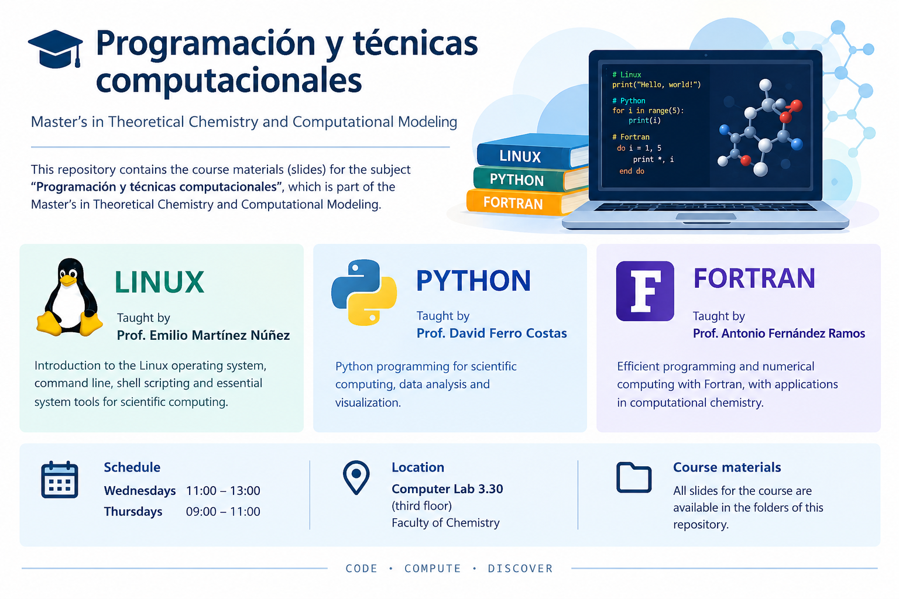

# Programación y técnicas computacionales

### Master in Theoretical Chemistry and Computational Modelling



## About the course

This repository contains the lecture slides and course materials for **Programación y técnicas computacionales**, part of the **Master in Theoretical Chemistry and Computational Modelling**.

The course provides practical training in essential programming tools and computational environments used in theoretical and computational chemistry.

## Course structure

The course is divided into three parts:

| Part | Instructor | Main focus |
|---|---|---|
| **Linux** | Prof. Emilio Martínez Núñez | Linux environment, command line and essential tools for scientific computing |
| **Python** | Prof. David Ferro Costas | Python programming for scientific and computational work |
| **Fortran** | Prof. Antonio Fernández Ramos | Fortran programming and its applications in computational chemistry |

## Course materials

The repository is organized into folders corresponding to the different parts of the course. **Lecture slides used during the course are available in these folders.**

## Schedule and location

- **Wednesdays:** 11:00–13:00
- **Thursdays:** 09:00–11:00
- **Classroom:** **Computer Room 3.30**, 3rd floor, Faculty of Chemistry

## Access to CESGA

As part of this course and the Master's programme, you are required to create a user account at the **Galician Supercomputing Center (CESGA)**. Please register through the [CESGA User Registration Portal](https://altausuarios.cesga.es/) using your institutional details and email address. Once your account has been activated, you will be able to access CESGA's high-performance computing (HPC) resources, which will be used for practical activities in the course, as well as for your Master's thesis (TFM).

While waiting for your CESGA account to be activated, it is recommended that you bring your own laptop with **Ubuntu for Windows (WSL)** installed, as the practical activities will require access to a Linux environment.

In addition to Ubuntu for Windows (WSL), you can also use the server **172.16.64.77** while your CESGA account is not yet active. To connect, use SSH:

```bash
ssh username@172.16.64.77
```

where `username` is your user name on the server.

If you are working from Windows, you can also connect to the server using [MobaXterm](https://mobaxterm.mobatek.net/download.html).
